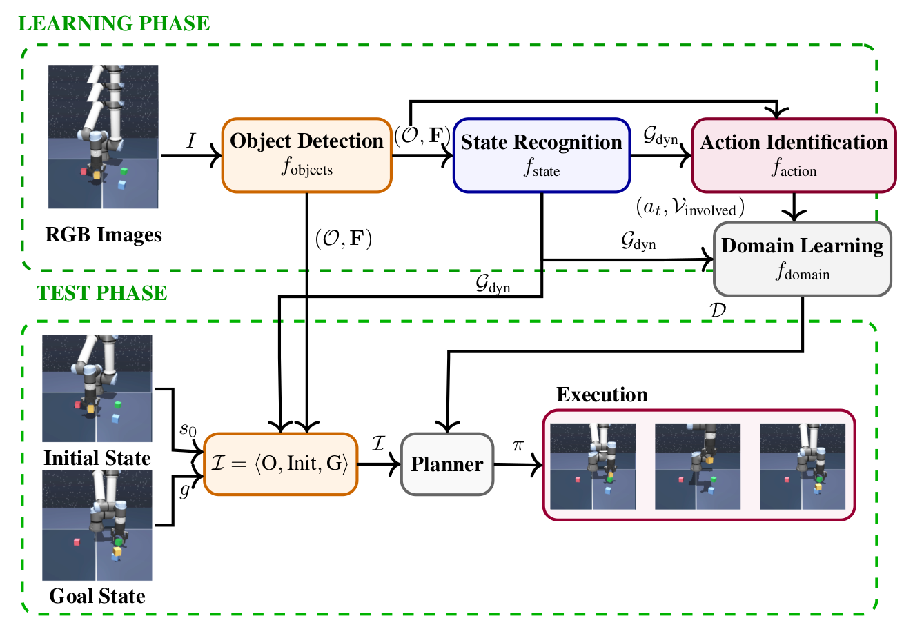
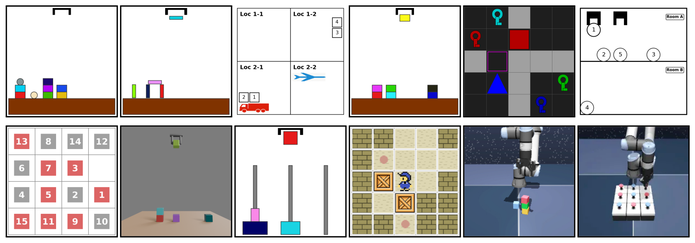

# VISA: Visual Interaction and Symbolic Abstraction

Implementation of:

**Learning Lifted Symbolic Planning Domains from Image Sequences**

---

## Overview

VISA learns **lifted STRIPS+ planning domains directly from image sequences**.

Input:
- raw image sequences  

Output:
- symbolic states  
- action traces  
- lifted PDDL domain  

Enables **planning directly from images** using standard planners. :contentReference[oaicite:0]{index=0}

---

## Pipeline

1. Object Detection (Faster R-CNN)  
2. State Recognition (DSG-DETR → scene graphs)  
3. Action Identification (ST-GCN)  
4. Domain Learning (SYNTH)  



---

## Repository Structure

```
config/
dataset/
dsg_generator/
action_classification/
resources/
```

---

## Quick Start

1. Specify desired dataset under [config/yaml_files/dsg_config.yaml](config/yaml_files/dsg_config.yaml)
2. Test object detector, dsg-generator, action identifier and domain learning:
```bash
./test_obj_det.sh
./test_dsg_gen.sh
./test_ac_id.sh
```

---

## Detailed Instructions

See: [README_detailed.md](README_detailed.md)

Contains:
- installation  
- dataset generation  
- training  
- evaluation  
- reproduction  

---

## Data & Models

Download pretrained models and datasets:

**TODO**

Place into:

```
resources/
```

---

## Results



---

## Citation

```bibtex
[ADD BIBTEX]
```